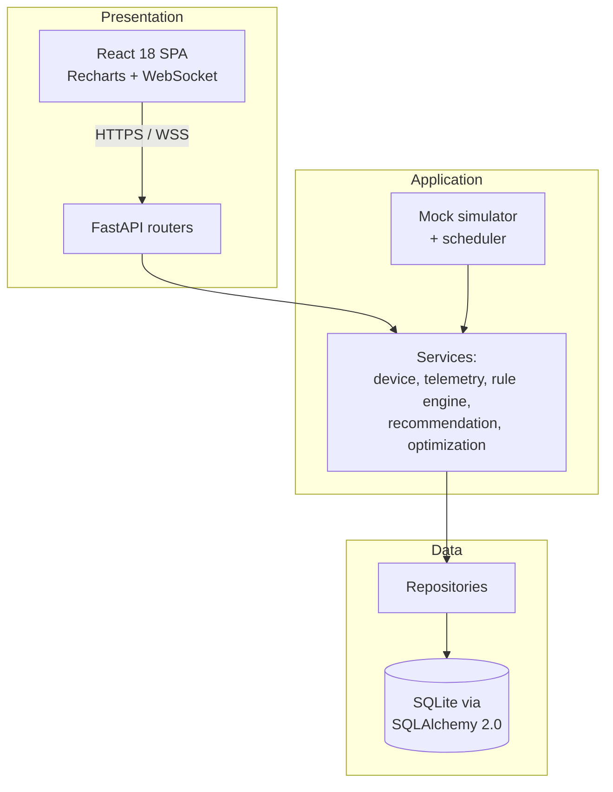

# Feasibility Study — AI-Driven Smart Home Energy Optimizer

**Project:** AI-Driven Smart Home Energy Optimizer
**Course:** IT3180E — Introduction to Software Engineering (HUST/SOICT)
**Document:** 01 — Feasibility Study
**Baseline:** SRS v1.0 (2026-04-30), [`srs_final.md`](../../Project_detail/srs_final.md) · refined notes [`refine_note.md`](../../Project_detail/refine_note.md)
**Status:** Approved at milestone M1 (see §5)

> Structure follows IT3180 Lecture 05 (Feasibility Study): client & problem, scope,
> benefits, technical feasibility, resources/schedule, risks, alternatives, and a
> go / no-go recommendation.

---

## 1. Client and Problem

**Client.** The client is an **IoT/AI contractor** who can supply many kinds of
smart-home devices (smart plugs, bulbs, fans, air conditioners, environmental
sensors) and wants a software product that adds value on top of that hardware
(`refine_note.md` §1). The client's intent, captured in the in-class discussion,
is a single application that lets a homeowner **monitor, control, and optimize**
household electricity usage and — critically — **see the money saved in VND**
(`refine_note.md` §2).

**Problem.** Households have a growing number of connected devices but no unified,
trustworthy view of where electricity (and money) goes, and no easy way to act on
it. Per-device vendor apps fragment control, hide cost, and never express savings
in the currency the user actually pays. The SRS *Purpose* states the system is a
"mobile/web IoT application that monitors household electricity consumption,
controls supported devices, and recommends rule-based actions to reduce
electricity cost" (SRS §1.1). The same section records the decisive client
feedback after the first presentation: *"keep the first release realistic, make
savings in VND visible, and make the Optimization Engine explainable rather than a
black-box AI model."*

**Product vision (SRS §1.4 Product Scope).** One-home energy monitoring and
optimization for smart plugs, bulbs, fans, ACs, and sensors: view current and
historical usage, set schedules/rules, receive recommendations, approve
auto-actions, and view estimated bill savings in VND.

**Why this is a software-engineering project.** The "AI" is deliberately
**deterministic, rule-based, and explainable**: every learned habit is converted
into a readable `WHEN <condition> THEN <action>` rule the user can inspect, edit,
accept, or dismiss (SRS §2.5; `refine_note.md` §1). The engineering challenge is
therefore in **requirements → design → implementation → verification
traceability**, architecture, design patterns, and configuration management — not
in machine learning.

---

## 2. Scope (In / Out)

Scope is taken directly from `refine_note.md` §3, aligned with SRS §1.4.

### In scope
- One-home energy monitoring and optimization (single household).
- Device types: **smart plug, smart bulb, fan, air conditioner, environmental
  sensor** (read-only).
- Real-time and historical electricity consumption (W and kWh).
- Device control through device APIs **or** a mock adapter.
- Schedule / conditional rule creation (`WHEN … THEN … [UNTIL …]`).
- Habit-based recommendations converted to readable rules.
- **VND bill-saving estimation** shown before acceptance and accumulated for the
  current billing cycle.
- Notifications and **opt-in** auto-actions with a 2-minute undo window.
- A **mock device simulator** for demo and automated tests (≥ plug, bulb, fan,
  AC, occupancy sensor).

### Out of scope
- Modifying IoT device firmware.
- Building physical IoT hardware.
- **Fully autonomous AI that acts without user approval.**
- **Black-box optimization** that cannot explain its recommendations.

### Course-specific delivery boundary
For the IT3180 deliverable the first release runs **entirely on the mock
simulator** — no real vendor integration is required to demonstrate or test any
requirement (SRS §2.4, "shall run with mock devices when physical hardware is
unavailable"; `refine_note.md` §11 open question on first-vendor API). This keeps
the project demoable, reproducible, and fully testable within a single semester.

---

## 3. Benefits (Economic Feasibility)

The value proposition is the **visible, quantified bill saving** the client asked
for. The seeded demo home makes this concrete and verifiable in the running system
(see [`seed.py`](../backend/app/seed.py)).

### Tariff model used for the demo
A representative **EVN-style residential tiered tariff** is seeded
(`seed.py` `EVN_TIERS`), priced in VND/kWh across six progressive tiers:

| Tier | Up to (kWh/month) | Price (VND/kWh) |
| :--- | :--- | :--- |
| 1 | 50 | 1,806 |
| 2 | 100 | 1,866 |
| 3 | 200 | 2,167 |
| 4 | 300 | 2,729 |
| 5 | 400 | 3,050 |
| 6 | above 400 | 3,151 |

Because the tariff is **tiered**, every kWh avoided at the margin is charged at
the *highest* applicable rate, so reductions are worth more than a flat-rate model
would suggest. The tariff is **manually configurable** in Settings (Business
Rule; SRS §3.3 "manual fallback required"), so the same product works for other
providers.

### Quantified benefit — the seeded "AC too cold" scenario
The demo seeds a bedroom AC habitually set to **24 °C** overnight
(`seed.py` `_bedroom_ac`). The recommendation engine detects this and proposes a
rule to raise the target a few degrees during sleeping hours. Using the SRS
savings formula

```text
estimated_monthly_saving_VND = sum((baseline_kWh - expected_kWh_with_rule) * tariff_VND_per_kWh)
```

(SRS REQ-4.5.2) the seeded recommendation yields an estimated saving on the order
of **≈ 35,000 VND/month for a single device** (the figure surfaced in the demo as
`estimated_monthly_saving_vnd`, `seed.py`). Stacking the other seeded
recommendations (e.g. an empty-room hallway light left on overnight, idle plug
shutdown) compounds this within the same five-recommendation cap.

### Benefit summary
- **For the homeowner:** a single dashboard showing current kW, today's kWh,
  estimated bill, monthly saving, and savings-so-far this cycle (SRS §3.1), with a
  clear money figure attached to every suggested action.
- **For the client (IoT contractor):** a hardware-agnostic value layer that makes
  the savings benefit of their devices tangible to customers, with a clean
  capability-schema extension point for new device types.
- **Economic feasibility for the course:** development cost is **student labor
  only**; the stack is **100% open-source** (Python, FastAPI, React, SQLite) with
  **zero licensing or cloud cost**, and **no hardware purchase** thanks to the
  simulator. The project is economically feasible by construction.

---

## 4. Technical Feasibility

### Chosen architecture
A **three-tier, layered architecture** (styles taken from the IT3180 lectures):



- **Presentation:** React 18 + Vite + react-router-dom + Recharts SPA, with live
  updates over **WebSocket**; FastAPI routers expose the REST API.
- **Application:** services hold the business logic; a background **mock
  simulator** emits telemetry and a **scheduler** evaluates rules.
- **Data:** a Repository layer over **SQLAlchemy 2.0 ORM + SQLite**.
- **Cross-cutting core:** JWT auth (PBKDF2 salted hashing), an in-process
  EventBus (Observer), clock, and error handling.

### Why this stack is feasible (and appropriate)
- **FastAPI (Python 3.13).** Async-first, so a single process can run the
  simulator, scheduler, and WebSocket fan-out concurrently and still meet the
  ≤ 5 s dashboard refresh (NFR-PER-1) and 100-simulated-home demo target
  (NFR-PER-3). Pydantic v2 gives declarative DTO validation that maps cleanly to
  the SRS "validate command values" requirement (REQ-4.2.3).
- **React + Recharts.** The dashboard is chart-heavy (power over time, top-3
  consumers, savings); React's component model fits the **capability-driven
  control rendering** the SRS mandates — the UI fetches
  `GET /devices/{id}/capabilities` and renders only supported controls
  (REQ-4.2.1).
- **SQLite + SQLAlchemy.** Zero-install, file-backed database — ideal for a
  reproducible course demo and CI; SQLAlchemy keeps the door open to PostgreSQL
  later with no model rewrite. Comfortably handles 12-month one-minute aggregate
  retention at demo scale (REQ-4.1.3).
- **Mock simulator instead of hardware.** Removes the single biggest technical
  risk (hardware availability/firmware) while satisfying REQ-4.2.5 and the SRS
  operating-environment clause (§2.4). The simulator is also the test fixture,
  making every functional requirement testable with no devices.

### At least one viable design — proven
A working reference implementation already exists under
[`project/backend`](../backend) and [`project/frontend`](../frontend), with
**54 passing automated tests** covering domain, RBAC, capability, monitoring,
rules, recommendations, savings, and safety. Design patterns from the syllabus are
realized explicitly: **Strategy** (device adapters), **Observer** (EventBus →
WebSocket / notifications), **State** (device & rule lifecycle), **Repository**,
and **Dependency Injection** (FastAPI `Depends`). Technical feasibility is
therefore not merely argued — it is demonstrated.

---

## 5. Resources, Schedule, and Milestones

### Resources
- **People:** the project team (students), self-organized into requirements,
  backend, frontend, and QA roles. No external specialists required.
- **Tools (all free):** Python 3.13 + venv, Node/Vite, Git for configuration
  management, pytest for verification, Mermaid/Markdown for docs.
- **Infrastructure:** developer laptops; no servers, no cloud spend, no hardware.

### 16-week (one-semester) schedule

```mermaid
gantt
  title 16-Week Schedule
  dateFormat  X
  axisFormat  W%s
  section Inception
  Feasibility & SRS baseline (M1)      :m1, 0, 3
  section Elaboration
  Architecture, UML, capability schema :a1, 3, 4
  section Construction
  Backend services + simulator (M2)    :c1, 5, 4
  Frontend SPA + integration (M3)      :c2, 9, 4
  section Transition
  V&V, acceptance tests, hardening     :t1, 13, 2
  Demo + handover (M4)                 :t2, 15, 1
```



### Milestones
| ID | Week | Milestone | Exit criteria |
| :-- | :-- | :-- | :-- |
| **M1** | 3 | **Feasibility & requirements baseline** | This document approved; SRS v1.0 frozen as the source of truth. |
| **M2** | 9 | **Backend progress / mid-term** | Domain model, repositories, services, simulator, and core APIs working; unit tests green. |
| **M3** | 13 | **Frontend integration progress** | SPA wired to API/WebSocket; capability-driven controls, dashboard, rules, recommendations, savings end-to-end. |
| **M4** | 16 | **Demo + handover** | Full acceptance-test pass; seeded demo home; docs delivered (feasibility, design/UML, test plan, configuration management). |

The schedule is feasible: a working baseline already meets most M2/M3 exit
criteria, so the time box has slack for V&V and documentation rigor — exactly what
this course rewards.

---

## 6. Risks and Mitigations

| # | Risk | Likelihood | Impact | Mitigation |
| :-- | :--- | :--- | :--- | :--- |
| R1 | **No physical IoT hardware** for demo/test. | High | High | **Mock simulator** (REQ-4.2.5) generates telemetry and accepts commands; it is the demo and the test fixture. Hardware becomes a later, optional adapter — no redesign needed (Strategy pattern). |
| R2 | **Scope creep** (extra device types, real vendor APIs, mobile-native app). | Medium | High | Freeze SRS v1.0 at M1; "out of scope" list (§2) is contractual; new device type = *one* capability schema + *one* adapter only (SRS §5.4 Maintainability). |
| R3 | **Tariff model uncertainty** (which provider, tiered vs peak-hour). | Medium | Medium | Use a configurable **tiered EVN-style** tariff (`seed.py`); manual override in Settings is required by the SRS (§3.3). Open question logged in `refine_note.md` §11. |
| R4 | **ML over-ambition** — temptation to build a predictive/black-box model. | Medium | High | Hard constraint: engine is **rule-based and explainable** (SRS §2.5). Habits become readable WHEN-THEN rules; out-of-scope list explicitly bars black-box optimization. |
| R5 | **Savings estimate inaccuracy** eroding user trust. | Medium | Medium | Deterministic 14-day baseline + transparent formula (REQ-4.5.1/2); after one cycle, rules drifting > ±20% are flagged "needs recalculation" (REQ-4.5.5). |
| R6 | **Safety incident** (e.g., auto power-off of a fridge, AC compressor short-cycling). | Low | High | Safety guards: no auto power-off of safety-critical devices, ≤ 1 AC compressor command / 3 min, rule-editor warnings (NFR-SAF-1/2/3); covered by `test_safety.py`. |
| R7 | **Team coordination / integration drift** over a 16-week part-time term. | Medium | Medium | Git-based configuration management, milestone gates (§5), layered architecture with clear interfaces, and an automated test suite (54 tests) as a regression net. |

---

## 7. Alternatives Considered

| Option | Description | Why not chosen |
| :--- | :--- | :--- |
| **Spring Boot (Java) backend** | Mature, strongly-typed enterprise framework. | Heavier boilerplate and slower iteration for a one-semester project; async telemetry/WebSocket fan-out and rapid schema-driven validation are more concise in FastAPI + Pydantic. Team velocity favors Python. |
| **Server-rendered web app** (Django/Flask templates, Thymeleaf) | Render HTML on the server; minimal JS. | Poor fit for **live ≤ 5 s dashboard updates** (NFR-PER-1) and capability-driven dynamic controls (REQ-4.2.1); would need ad-hoc polling/JS anyway. A React SPA + WebSocket is cleaner and matches the chart-heavy UI. |
| **Node.js / Express backend** | Single-language (JS) full stack. | Viable, but Python's data/ORM ergonomics (SQLAlchemy 2.0, Pydantic) and the team's familiarity make FastAPI the lower-risk choice; tariff/baseline math and the simulator are clearer in Python. |
| **Real IoT vendor integration first** | Integrate an actual device API for the first release. | Adds hardware/vendor dependency and untestable demo paths within the term (R1). Deferred behind the adapter interface; the mock simulator satisfies all SRS requirements now. |
| **NoSQL store (MongoDB)** | Document store for telemetry. | Unnecessary operational overhead for a single-home demo; relational model (homes/users/devices/readings/rules/savings) maps naturally to SQLAlchemy + SQLite with zero install. |

The chosen stack — **FastAPI + React + SQLite + mock simulator** — is the
lowest-risk option that satisfies every functional and nonfunctional requirement
within the time box.

---

## 8. Go / No-Go Recommendation

**Recommendation: GO.**

The project is feasible on every dimension assessed:

- **Operationally** — the problem is well-defined, the SRS is baselined, and the
  scope is bounded with an explicit out-of-scope list.
- **Technically** — a working reference implementation already exists with 54
  passing tests, the required design patterns realized, and all NFR targets
  achievable on the chosen stack; the mock simulator removes the only serious
  technical risk.
- **Economically** — zero hardware, licensing, or cloud cost; development is
  student labor only, and the seeded demo demonstrates concrete value
  (tiered EVN tariff; ≈ 35,000 VND/month from a single AC recommendation).
- **Schedule-wise** — the work fits a 16-week semester with four clear milestones
  (M1 feasibility → M2/M3 progress → M4 demo + handover) and slack reserved for
  V&V and documentation.
- **Course fit** — the deliberately rule-based, explainable design keeps the
  effort focused on software-engineering rigor (requirements traceability,
  architecture, patterns, V&V, configuration management), which is what IT3180E
  grades.

**Proceed to the Elaboration phase**: architecture and UML modeling, the
capability-schema design, and the test plan that traces each REQ/NFR to an
acceptance test (`refine_note.md` §10).
