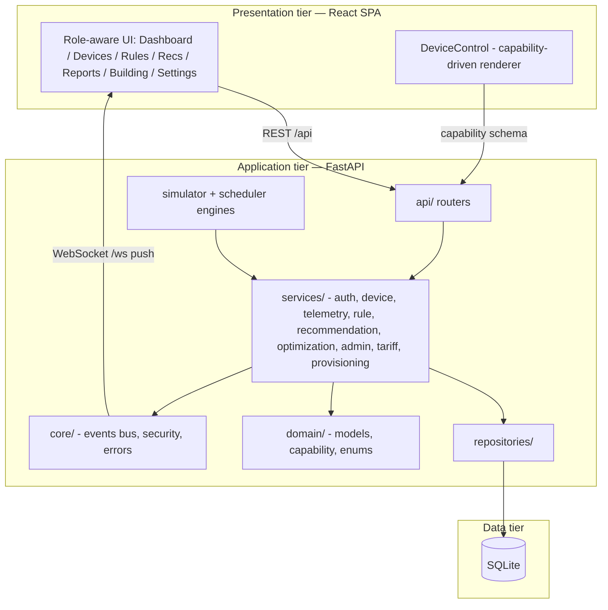
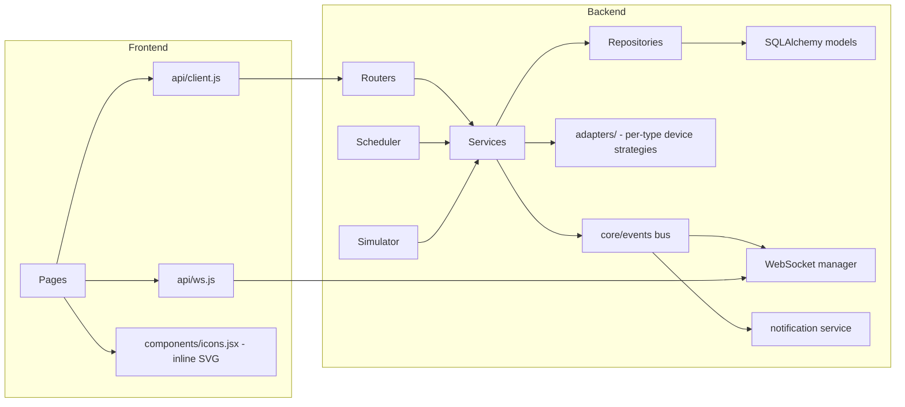
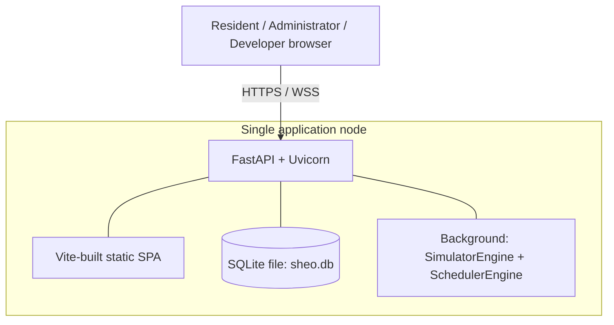
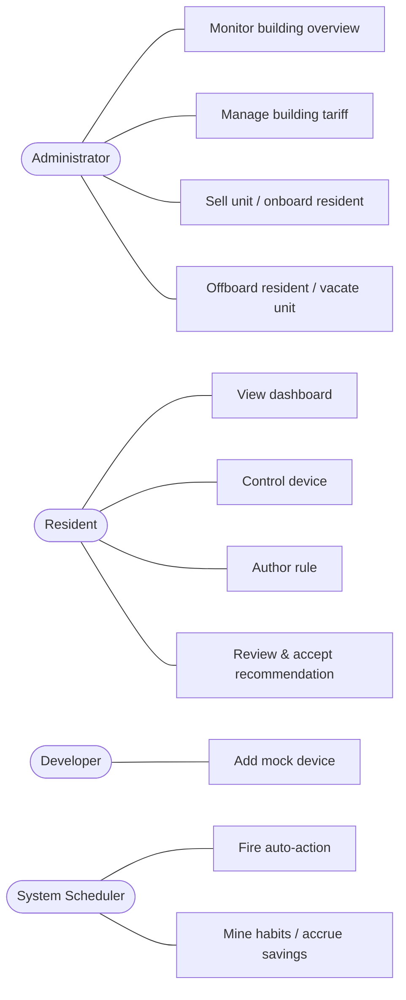
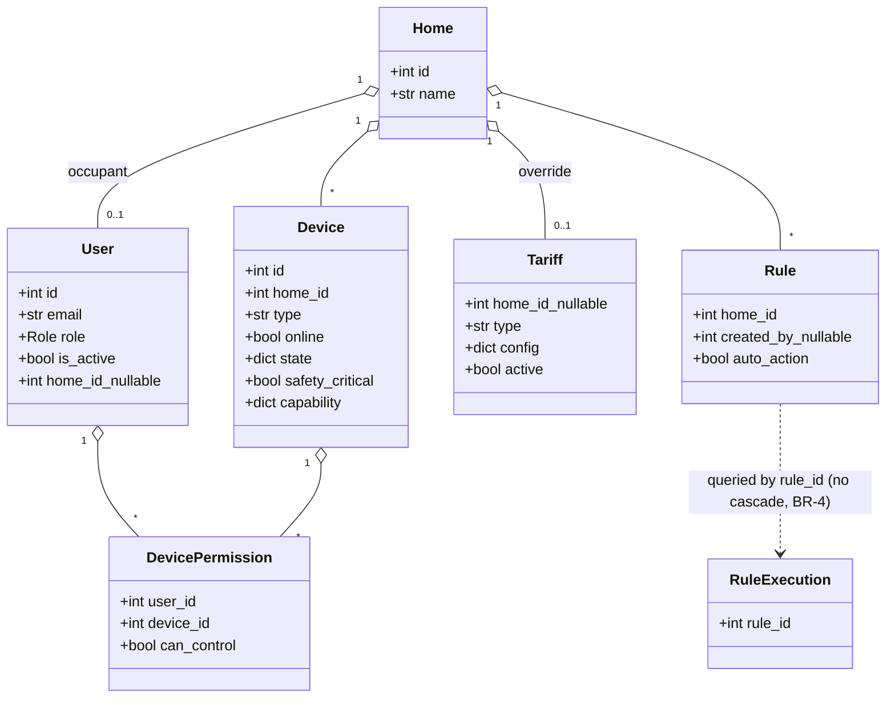
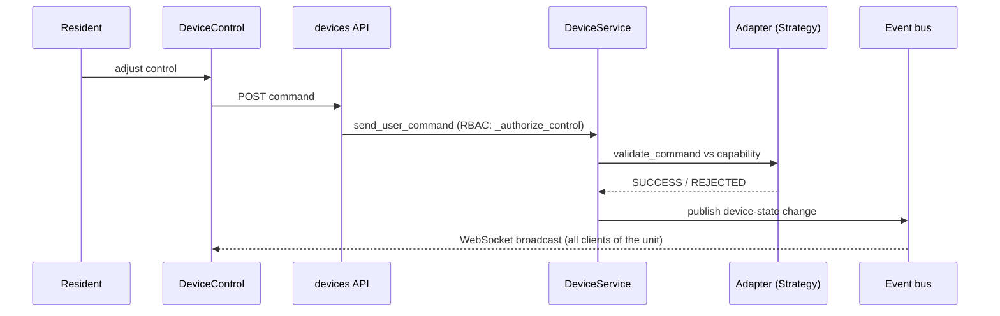
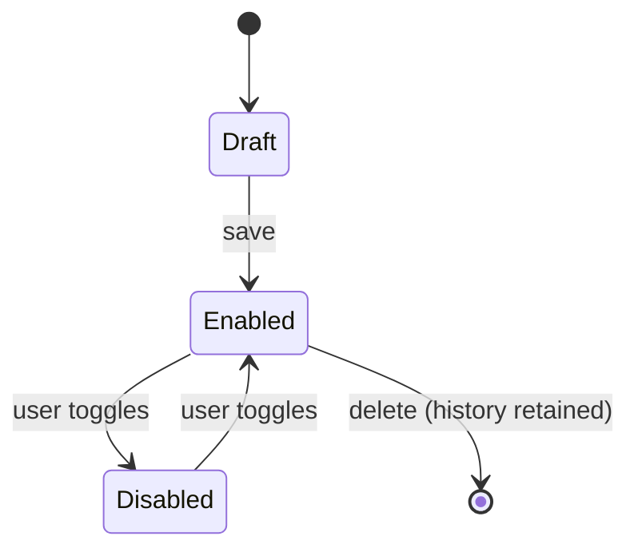

# Software Design Document — SHEO

**AI-Driven Smart Home Energy Optimizer (SHEO)**
Course: IT3180E — Introduction to Software Engineering (HUST, SoICT)

| | |
|---|---|
| **Document** | Software Design Document (SDD), per IEEE Std 1016 |
| **Version** | v2.0 (2026-06-22) |
| **Supersedes** | v1.0 — single-shared-home model |
| **Realises** | [`srs_final.md`](../../Project_detail/srs_final.md) (SRS v2.0) |
| **Authoritative source** | The LaTeX report (`project/latex/report`) chapters 5–6; this document is the standalone design view. |

> **v2.0 change summary.** Re-architected to a **multi-unit apartment-building** model:
> nullable building-wide tariff; Administrator as building owner (no unit, view-only);
> unit provisioning on sale; cross-unit isolation (NFR-SEC-4); building-overview data
> minimisation (NFR-SEC-5); soft offboarding of residents (BR-1).

---

## 1. Introduction

### 1.1 Purpose & scope
This SDD describes **how** SHEO is structured to satisfy the SRS: the design goals, the
architecture and its components, the domain model, the design patterns, the central
behaviours, the data and security design, and the UI design. It documents the design as a
software design description in the sense of **IEEE 1016**.

### 1.2 Relationship to the SRS
Where the SRS states the observable behaviour (the *what*), this document states the
realisation (the *how*). Every design element traces back to a requirement
(REQ/NFR/BR) and forward to code and tests via
[`docs/03-requirements-traceability-matrix.md`](03-requirements-traceability-matrix.md).

---

## 2. Design Goals

1. **Single source of truth for device behaviour** — one capability schema drives the API, the UI, and command validation.
2. **Traceability** — requirement → component → code → test must be auditable.
3. **Least privilege & privacy** — role-scoped access, cross-unit isolation, and data minimisation in oversight.
4. **Hardware-readiness** — a device-adapter contract lets a real driver replace a mock with no API/UI change.
5. **Explainability** — every automation and every saving is expressed in plain language and VND.

---

## 3. Architecture — Three-Tier + Layered

SHEO is a three-tier web application with a layered backend. Routers are thin; no raw
SQLAlchemy appears in routers.



**Style rationale.** A layered backend keeps presentation/application/data concerns
separable and testable; the event bus (Observer) decouples state changes from their
consumers (WebSocket push, notifications).

---

## 4. Component Decomposition



Six device types are supported by one capability schema entry + one adapter each
(plug, bulb, fan, air-conditioner, sensor).

---

## 5. Deployment



One deployment models one apartment building. The simulator replaces physical IoT
hardware; a real adapter would connect over an IoT messaging protocol with no change to
the API or UI tiers.

---

## 6. Use-Case View



The Administrator never operates a unit's devices and authors no rules (least privilege).

---

## 7. Domain / Class Model



> `home_id` on `User`/`Tariff` and `created_by` on `Rule` are **nullable** (NULL = the
> Administrator / building-wide tariff / an offboarded author). `Home` is a unit occupied by
> 0..1 Resident.

The unit (`Home`) is the aggregate root. `User.home_id` and `Tariff.home_id` are nullable
(NULL = the Administrator / the building-wide tariff). `Rule → RuleExecution` is deliberately
**not** an ORM relationship so deleting a rule preserves its history (BR-4).

---

## 8. The Capability Schema (the design's heart)

Each device type has one declarative schema (`domain/capability.py`) describing its
telemetry and its controls (kind, range, allowed values, safety flags). It drives:
- the **frontend** `DeviceControl` renderer — zero per-type UI branching; and
- the **backend** `validate_command` — range/enacted-value checks.

Adding a device type = **1 schema entry + 1 adapter**. This is the single source of truth
that satisfies REQ-4.2.1 and eliminates a whole class of UI/API drift.

### 8.1 The recommendation provider — the swappable "AI" boundary

The client is an **AI contractor** who supplies the AI, so "finding the habit" is modelled
as an externally-suppliable concern, not baked into SHEO. Habit **detection** sits behind a
`RecommendationProvider` **port** (Strategy, `services/recommendation_provider.py`):

```
RecommendationProvider (ABC)
  └─ mine(home_id) -> [RecommendationCandidate]   # WHEN/THEN + rationale, NO money
HeuristicRecommendationProvider   # shipped default: deterministic, explainable miners
FakeProvider / MLProvider …       # any substitute behind the same port
```

- The provider is **injected at the composition root** (the `RecommendationService`
  constructor); the default is the explainable heuristic miner. A **black-box ML provider**
  implementing the same port can replace it without touching the API, UI, rule engine, or
  the VND estimator. *(Verified by a swappability test: default is heuristic; an injected
  provider is the one consulted.)*
- **Money stays out of the black box.** A `RecommendationCandidate` carries no VND — the
  saving (REQ-4.5) is computed by SHEO's `OptimizationService`, and the
  `RecommendationService` owns ranking, the min-saving filter, the active cap, suppression,
  and conversion to a rule. This keeps the client's highest-priority, must-be-trustworthy
  figure as SHEO's own transparent software.

This mirrors the device-adapter pattern exactly: as mock adapters make SHEO *hardware-ready*
behind a device port, the provider port makes it *model-ready* behind an AI port.

---

## 9. Design Patterns

| Pattern | Where | SOLID/principle |
|---|---|---|
| **Strategy** | `adapters/` per-type device behaviour; **`RecommendationProvider`** (swappable AI habit-miner) | OCP — add a device type or swap the AI provider without editing callers |
| **Observer** | `core/events` bus → WebSocket push + notifications | decouple state change from consumers |
| **State** | device connectivity & rule/recommendation lifecycles | explicit, auditable transitions |
| **Repository** | `repositories/` | isolate persistence from services |
| **Dependency Injection** | `api/deps.py` | testability; LSP/DIP |

---

## 10. Key Behaviours

### 10.1 Capability-driven control (REQ-4.2)



RBAC rejects an Administrator command by role (403) before any lookup; a Resident may
control only devices granted via `DevicePermission`; the safety-critical fridge is granted
to nobody and cannot be forced offline.

### 10.2 Automatic rule firing (REQ-4.3.6)

```mermaid
sequenceDiagram
  participant Sch as SchedulerEngine
  participant RE as RuleService
  participant Dev as DeviceService
  participant B as Event bus
  Sch->>RE: evaluate enabled rules
  RE->>RE: condition holds & auto-action opted in?
  RE->>Dev: dispatch action (capability-validated)
  RE->>RE: append immutable RuleExecution (BR-4)
  RE->>B: publish; notify; offer 2-min undo
```

---

## 11. State Machines


*Rule lifecycle.* Recommendation lifecycle: `Suggested → Accepted (becomes a Rule) | Dismissed (suppressed ≥ 30 days)`. Device connectivity: `Online → Unreachable (>60 s silence) → Online`; a safety-critical device cannot be forced offline.

---

## 12. Data Design

- **SQLite** with SQLAlchemy 2.0. `create_all` on first start; the seed is skipped if any `Home`/`User` exists.
- `TZDateTime` and `EnumType` `TypeDecorator`s store naive-UTC / `.value` and return aware-UTC / real Enum.
- Policy thresholds (5 s refresh, 60 s offline, 14-day baseline, 7-day minimum history, 5 active recommendations, 30-day dismissal, 2-min undo, AC compressor interval, ±20% drift) are centralised in `config.py`.
- `Rule → RuleExecution` has **no** cascade (BR-4): execution history outlives the rule.

---

## 13. Security & Privacy Design

- **Authentication + RBAC** (NFR-SEC-2): `require_admin`, `require_admin_or_dev`; disabled accounts (`is_active = False`) cannot authenticate.
- **No plaintext secrets** (NFR-SEC-3): salted password hashing.
- **Cross-unit isolation** (NFR-SEC-4): repository/service unit-scoping; a cross-unit device id yields 404. Unit-scoped endpoints guard `home_id is None` so an Administrator request returns a clean 403, never a NULL query.
- **Data minimisation in oversight** (NFR-SEC-5): the building overview exposes only aggregate per-unit metrics (load, energy, bill) and device **reachability** — never per-device on/off state — so the owner's oversight cannot reveal a resident's real-time behaviour. The roster label is "reachable", not "on".
- **Soft offboarding** (BR-1): `AdminService.offboard_resident` deactivates + detaches the resident and revokes their `DevicePermission` grants; the unit, its devices, and all history are retained, and the unit shows as vacant.

---

## 14. UI Design

- **Capability-driven**: `DeviceControl` renders any device from its schema (no per-type code).
- **Role-aware navigation**: Administrators see only **Building** + **Settings**; residents/developers see the unit Dashboard/Devices/Rules/Recommendations/Reports.
- **BAN-led dashboard**: big headline numbers, Okabe–Ito colour-blind-safe palette, live over WebSocket.
- **Building overview** (Administrator): roster + per-unit load/kWh/bill + totals + read-only drill-in; a **Remove** action soft-offboards a resident. Vacant units remain as owner inventory.
- **Icons**: a small inline-SVG icon set (`components/icons.jsx`, `currentColor`); only functional status marks (✓ ✗ ⚠) remain as text.

---

## 15. Bill-Saving Algorithm (REQ-4.5)

`saved_vnd = Σ((baseline_kWh − expected_kWh) × tariff)`, always with a plain-language
explanation. A 14-day hourly baseline profile is computed per device; the estimate is shown
**before** the user commits (REQ-4.5.3); realised savings accrue per cycle (REQ-4.5.4); a
rule is flagged for recalculation when measured saving drifts beyond ±20% (REQ-4.5.5).
Background loops (`SimulatorEngine`, `SchedulerEngine`) run only when `enable_background`.
