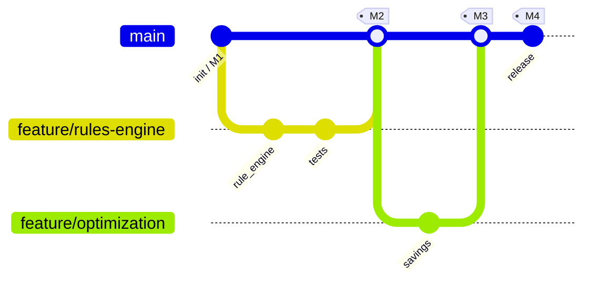
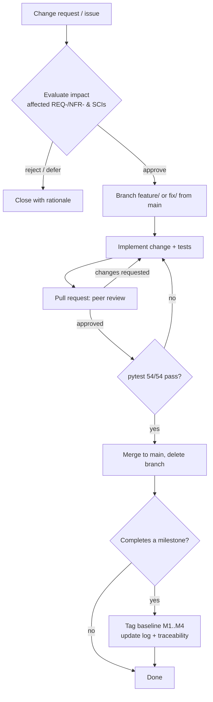

# Configuration Management Plan

**Project:** AI-Driven Smart Home Energy Optimizer (SHEO)
**Course:** IT3180E — Introduction to Software Engineering (HUST/SOICT)
**Document:** 05 — Configuration Management Plan (IT3180 Lecture 16)
**Version:** 1.0
**Baseline source of requirements:** [srs_final.md](../../Project_detail/srs_final.md) (SRS v1.0)

---

## 1. Purpose & Scope

### 1.1 Purpose

This Software Configuration Management (SCM) Plan defines how the SHEO team identifies,
versions, baselines, changes, builds, and audits every work product of the project. Its
goal is to keep the requirements → design → code → test chain consistent and reproducible:
at any point in time we can name an exact version of each artifact, know which requirement
it satisfies, and rebuild a runnable system from it.

The plan covers the four classic SCM activities from the lecture:

1. **Configuration identification** — naming the items under control (Section 2).
2. **Version control** — where items live and how revisions are tracked (Section 3).
3. **Change control** — how a change is requested, approved, implemented, and released
   (Sections 4–5).
4. **Status accounting & audit** — knowing the state of every item and verifying baselines
   (Section 7).

### 1.2 Scope

This plan applies to the entire `project/` tree: backend source, frontend source, the SRS
and all `docs/` deliverables, the automated test suite, build manifests, and runtime
configuration. It is written for **this repository's actual layout** — every path and file
named below exists in the project as delivered.

Out of scope: physical IoT firmware (the SRS explicitly excludes it; SHEO consumes device
APIs only via the mock simulator) and third-party hosting infrastructure.

---

## 2. Configuration Items (SCIs)

A Software Configuration Item (SCI) is any artifact placed under version control and
subject to the change process. SHEO groups its SCIs as follows.

| # | SCI group | Location | Representative items | Owner |
|---|-----------|----------|----------------------|-------|
| C1 | Requirements baseline | `Project_detail/` | [srs_final.md](../../Project_detail/srs_final.md) (SRS v1.0), [refine_note.md](../../Project_detail/refine_note.md) | Requirements lead |
| C2 | Design & engineering docs | `project/docs/` | This plan, SRS-derived design docs, UML/Mermaid models under `docs/diagrams/` | Architect |
| C3 | Backend source | `project/backend/app/` | `main.py`, `api/`, `services/`, `repositories/`, `domain/`, `core/`, `adapters/`, `simulator/`, `schemas/`, `seed.py` | Backend devs |
| C4 | Frontend source | `project/frontend/src/` | `App.jsx`, `pages/`, `components/`, `api/`, `auth/`, `lib/`, `index.css` | Frontend devs |
| C5 | Test suite | `project/backend/tests/` | `conftest.py` + 8 `test_*.py` modules (54 collected cases) | QA / all devs |
| C6 | Build & dependency manifests | `project/backend/`, `project/frontend/` | [requirements.txt](../backend/requirements.txt), [package.json](../frontend/package.json), `frontend/package-lock.json`, [vite.config.js](../frontend/vite.config.js) | Build owner |
| C7 | Runtime configuration | `project/backend/app/` | [config.py](../backend/app/config.py) (all SRS policy thresholds), `.env` (local, not committed) | Backend lead |

### 2.1 Notes on selected SCIs

- **Requirements (C1).** The SRS is the *source of truth*. Functional requirements use the
  `REQ-<section>.<number>` convention and nonfunctional ones use `NFR-<category>-<number>`;
  these identifiers are the anchors for the traceability matrix (Section 7).

- **Configuration (C7).** Every SRS policy threshold is centralized in
  [`config.py`](../backend/app/config.py) — for example `offline_threshold_seconds = 60`
  (REQ-4.1.4), `reading_retention_days = 365` (REQ-4.1.3), `baseline_days = 14`
  (REQ-4.5.1), `savings_drift_threshold = 0.20` (REQ-4.5.5), `undo_window_seconds = 120`
  (REQ-4.3.6), and `ac_compressor_min_interval_seconds = 180` (NFR-SAF-1). Treating
  thresholds as configuration data — not scattered literals — means a policy change is a
  one-line, reviewable, baseline-able edit.

- **Build manifests (C6).** Backend dependencies are **pinned** in `requirements.txt`
  (e.g. `fastapi==0.115.6`, `SQLAlchemy==2.0.36`, `pydantic==2.10.4`). Frontend
  dependencies are pinned in `package.json` and locked by `package-lock.json`. Pinning is
  what makes a baseline reproducible.

- **Derived (non-SCI) artifacts.** Generated outputs are **not** baselined and should be
  excluded via `.gitignore`: `backend/.venv/`, `backend/.pytest_cache/`, `__pycache__/`,
  the SQLite database `backend/sheo.db`, `frontend/node_modules/`, and the Vite build
  output `frontend/dist/`. They are reproducible from the SCIs above.

---

## 3. Repository & Version Control

### 3.1 Tooling

The project uses **Git** as the single version-control system, hosting the whole `project/`
tree (and the `Project_detail/` SRS) in one repository. One repository keeps the
requirements, code, tests, and docs in a single coherent history so a baseline tag captures
all of them at once.

> Setup note: the delivered tree is not yet a Git repo. Initialize once with
> `git init`, add a `.gitignore` for the derived artifacts listed in §2.1, and make the
> initial commit the **M1 baseline** (Section 4).

### 3.2 Branch model

A lightweight trunk-plus-feature model, appropriate for a small course team:

- **`main`** — the integration branch. Always buildable and green (all 54 tests pass).
  Direct commits to `main` are not allowed; changes arrive only via reviewed merges.
- **`feature/<short-name>`** — one branch per change request / task, branched from `main`
  (e.g. `feature/req-4.3.3-conflict-detection`, `feature/docs-cmp`). Short-lived; deleted
  after merge.
- **`fix/<short-name>`** — same rules as feature branches, for defect fixes.



### 3.3 Commit conventions

Commits follow a `type(scope): summary` style so history is scannable and links back to
requirements:

```
feat(rules): REQ-4.3.3 detect conflicting enabled rules on same device
fix(safety): NFR-SAF-2 block auto power-off of safety-critical devices
test(savings): cover REQ-4.5.5 drift > 20% -> needs recalculation
docs(cmp): add configuration management plan
```

Rules:
- `type` ∈ {`feat`, `fix`, `test`, `docs`, `refactor`, `chore`}.
- `scope` is the affected module/feature (e.g. `rules`, `devices`, `telemetry`).
- The summary **cites the REQ/NFR id** whenever the change implements or affects a
  requirement — this is what makes status accounting (Section 7) cheap.

### 3.4 Tags for milestone baselines

Each milestone baseline is an annotated, immutable Git tag on `main`:
`M1`, `M2`, `M3`, `M4` (see Section 4). A tag freezes the exact commit so the grader can
check out any milestone and rebuild it.

---

## 4. Baselines

A **baseline** is a formally reviewed, version-locked set of SCIs that serves as the basis
for further work; it changes only through the change-control process (Section 5).

| Milestone | Tag | What is baselined | Entry criteria |
|-----------|-----|-------------------|----------------|
| **M1 — Requirements** | `M1` | SRS v1.0 (`srs_final.md`), `refine_note.md`, initial `docs/` scaffold, repository + `.gitignore` | SRS approved by client/instructor; all REQ/NFR ids stable |
| **M2 — Design & skeleton** | `M2` | Architecture & UML docs in `docs/`; backend package skeleton (`domain/`, `core/`, `repositories/`, `api/` stubs); `config.py` thresholds; `requirements.txt` / `package.json` pinned | Design reviewed; skeleton imports and starts |
| **M3 — Implementation** | `M3` | Full backend services (`services/`, `adapters/`, `simulator/`), frontend pages/components, seed data, complete test suite | All 54 tests pass; demo seeds 21 days of data and runs |
| **M4 — Release / submission** | `M4` | The entire `project/` tree consistent end-to-end: docs ↔ code ↔ tests; this CMP; traceability matrix complete | Test gate green; traceability matrix 100%; configuration audit passed (Section 7) |

Each baseline is recorded in the status-accounting log (Section 7) with its tag, date, and
the change requests it incorporates.

---

## 5. Change Control Process

Any change to a baselined SCI — a new requirement, a defect fix, a threshold tweak in
`config.py`, a doc revision — goes through three stages. Small course teams keep this
lightweight but the gates are real.

### Stage 1 — Request → Evaluate → Approve

1. **Request.** Raise an issue (Section 7) describing the change, the SCIs affected, and the
   REQ/NFR ids it touches.
2. **Evaluate.** A reviewer assesses impact: which requirements, which modules, which tests,
   and whether a *baselined* item is affected (changes to a baseline need stronger
   justification).
3. **Approve.** The Configuration Control authority (Section 8) approves, defers, or rejects.
   Approved requests are scheduled to a branch.

### Stage 2 — Implement on branch → Review

4. **Implement.** Create a `feature/`/`fix/` branch from `main`; make the change *plus* the
   tests that prove it; cite the REQ/NFR id in commits.
5. **Review.** Open a pull/merge request. A second team member reviews for correctness,
   adherence to the layered architecture (presentation → application → data), and that the
   change is traceable to a requirement. No self-merges.

### Stage 3 — Test → Merge → Release

6. **Test.** The full suite (`pytest`, 54 cases) must pass on the branch — this is the
   merge gate.
7. **Merge.** Squash-or-merge into `main`; delete the branch.
8. **Release.** If the change completes a milestone, tag the new baseline (`M1`..`M4`) and
   update the status-accounting log and traceability matrix.



---

## 6. Build & Release

Builds are reproducible because every dependency is pinned (Section 2) and all runtime
policy lives in configuration, not code.

### 6.1 Backend build & run

```bash
cd project/backend
python -m venv .venv
. .venv/bin/activate
pip install -r requirements.txt        # pinned versions -> reproducible
uvicorn app.main:app --reload
```

On first start, `app.main`'s lifespan hook runs `init_db()` then seeds the demo home,
3 users, tiered EVN tariff, 6 devices, and 21 days of history, and starts the background
simulator + scheduler loops. Backend version is declared in `app/__init__.py`
(`__version__ = "1.0.0"`).

### 6.2 Frontend build & run

```bash
cd project/frontend
npm install            # locked by package-lock.json
npm run dev            # Vite dev server on :5173, proxies /api and /ws to 127.0.0.1:8000
# production bundle:
npm run build          # emits dist/ (a derived artifact — not baselined)
npm run preview        # serves the built bundle on :4173
```

The dev proxy is defined in [vite.config.js](../frontend/vite.config.js) so the SPA uses
same-origin relative URLs against the FastAPI backend.

### 6.3 Environment configuration via `SHEO_*` variables

Runtime configuration is centralized in [config.py](../backend/app/config.py). `Settings`
uses `pydantic-settings` with `env_prefix="SHEO_"` and an optional `.env` file, so **any
field is overridable by an environment variable** named `SHEO_<FIELD>` — without editing
code or rebuilding. The `.env` file is local and **must not be committed** (it can carry
secrets; see C7). Key variables:

| Env var | Field / default | Purpose (requirement) |
|---------|-----------------|------------------------|
| `SHEO_DATABASE_URL` | `database_url` = `sqlite:///./sheo.db` | Persistence target |
| `SHEO_JWT_SECRET` | `jwt_secret` = `dev-only-secret-change-in-production` | Token signing — **override in any real deployment** (NFR-SEC-3) |
| `SHEO_ACCESS_TOKEN_EXPIRE_MINUTES` | `access_token_expire_minutes` = `720` | Session lifetime (NFR-SEC-2) |
| `SHEO_TELEMETRY_INTERVAL_SECONDS` | `telemetry_interval_seconds` = `2.0` | Live emit cadence ≤ 5s (REQ-4.1.1) |
| `SHEO_OFFLINE_THRESHOLD_SECONDS` | `offline_threshold_seconds` = `60` | Offline detection (REQ-4.1.4) |
| `SHEO_BASELINE_DAYS` | `baseline_days` = `14` | Savings baseline (REQ-4.5.1) |
| `SHEO_SAVINGS_DRIFT_THRESHOLD` | `savings_drift_threshold` = `0.20` | Drift recalculation (REQ-4.5.5) |
| `SHEO_SEED_ON_STARTUP` | `seed_on_startup` = `True` | Demo seeding toggle |
| `SHEO_ENABLE_BACKGROUND` | `enable_background` = `True` | Simulator + scheduler loops (set `False` in tests) |
| `SHEO_CORS_ORIGINS` | `cors_origins` | Allowed frontend dev origins |

Because thresholds are configuration, the same baselined build serves the demo, a test run
(`SHEO_ENABLE_BACKGROUND=false`), and a tuned deployment — only the environment differs.

### 6.4 Reproducibility checklist

- Backend: identical `requirements.txt` → identical dependency set.
- Frontend: `npm ci` against the committed `package-lock.json` for byte-stable installs.
- No environment-specific values are hard-coded; all overrides flow through `SHEO_*`.

---

## 7. Status Accounting & Audit

### 7.1 Issue tracking (status accounting)

Every change request, defect, and task is recorded as a tracker **issue** with: a unique id,
the affected SCIs, the REQ/NFR id(s) involved, current state (`open → in-progress →
in-review → merged → released`), and the branch/PR that resolves it. The issue id is
referenced in the branch name and commit messages, giving a complete forward/backward trail
between requirements, changes, and code.

A **baseline log** records, for each tag `M1`..`M4`: the tag, the date, and the list of
issues/change requests included. This is the canonical "what is the state of every item"
record.

### 7.2 Traceability matrix — the audit link

The requirements-to-implementation traceability matrix is the backbone of the configuration
**audit**: it proves each REQ/NFR is realized in code and exercised by a test. The matrix
already exists in machine-checkable form (the SRS catalogue mapping). Representative rows:

| Requirement | Implementation (file · function/class) | Verifying test |
|-------------|----------------------------------------|----------------|
| REQ-4.1.1 (≤5s refresh) | `simulator/engine.py` `SimulatorEngine` + `services/telemetry_service.py` `dashboard` + `api/ws.py` | `test_monitoring.py` |
| REQ-4.1.4 (offline >60s) | `services/telemetry_service.py` `refresh_online_status`; `config.offline_threshold_seconds` | `test_monitoring.py` |
| REQ-4.2.3 (validate vs ranges) | `domain/capability.py` `validate_command`; `services/device_service.py` `apply_command` | `test_devices_capability.py` |
| REQ-4.3.3 (conflict detection) | `services/rule_engine.py` `_detect_conflicts` | `test_rules.py` |
| REQ-4.3.6 (opt-in + 2-min undo) | `services/rule_engine.py` `execute`/`undo`; `config.undo_window_seconds` | `test_rules.py` |
| REQ-4.5.2 (VND saving formula) | `services/optimization_service.py` `estimate_rule` | `test_savings.py` |
| REQ-4.5.5 (±20% drift) | `services/optimization_service.py` `check_drift`; `config.savings_drift_threshold` | `test_savings.py` |
| NFR-SAF-1 (≤1 AC cmd/3min) | `services/device_service.py` `_safety_check`; `config.ac_compressor_min_interval_seconds` | `test_safety.py` |
| NFR-SAF-2 (no auto power-off safety-critical) | `services/device_service.py` `_safety_check` | `test_safety.py` |
| NFR-SEC-2/4 (auth + RBAC + home scope) | `core/security.py`; `api/deps.py` `require_roles`/`require_owner`; services scope by `home_id` | `test_auth_rbac.py` |

> The full matrix lives in the requirements/traceability deliverable under `docs/`; the
> audit step (M4) walks every row and confirms the cited code and test exist and match.

### 7.3 Test suite as the gate

The automated suite is the **acceptance gate** for every merge and every baseline. It is
run from the backend with `pytest` and currently collects **54 cases** across:
`test_unit_domain.py`, `test_auth_rbac.py`, `test_devices_capability.py`,
`test_monitoring.py`, `test_rules.py`, `test_recommendations.py`, `test_savings.py`, and
`test_safety.py`. Tests run with background loops disabled (`enable_background=False`) for
determinism. **No branch merges to `main` unless the suite is green**, which is what keeps
`main` continuously releasable.

```bash
cd project/backend
. .venv/bin/activate
pytest          # 54 passed == merge/baseline gate satisfied
```

### 7.4 Configuration audits

Two audits are performed at each milestone (and especially at M4):

- **Functional audit** — does the baseline satisfy its requirements? Verified via the
  traceability matrix + the passing test suite.
- **Physical audit** — does the baseline contain exactly the expected SCIs at the expected
  versions, with derived artifacts excluded? Verified by checking the tag's tree against
  Section 2 and the `.gitignore` rules.

---

## 8. Roles & Responsibilities

| Role | Responsibility in SCM |
|------|------------------------|
| **Configuration Manager** | Owns this plan; maintains the baseline log and tag discipline; chairs change-control decisions; runs the M-milestone audits. |
| **Requirements lead** | Owns the SRS baseline (C1); ensures REQ/NFR ids remain stable; approves requirements-affecting changes. |
| **Architect** | Owns design docs (C2); reviews that changes respect the three-tier / layered architecture and design patterns. |
| **Backend / Frontend developers** | Implement changes on branches with tests; cite REQ/NFR ids in commits; do not commit to `main` directly. |
| **QA lead** | Owns the test suite (C5) as the gate; ensures every accepted change adds/updates tests; verifies the suite is green before merge. |
| **Reviewer (peer)** | Performs Stage-2 code review on each pull request; no self-merges. |
| **Build owner** | Owns dependency manifests (C6) and reproducible-install discipline; keeps versions pinned. |

For a small course team one person may hold several roles, but the **separation between
author and reviewer/approver is always preserved** — the core control that makes the
process auditable.
